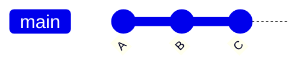
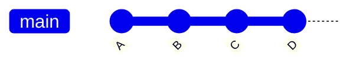
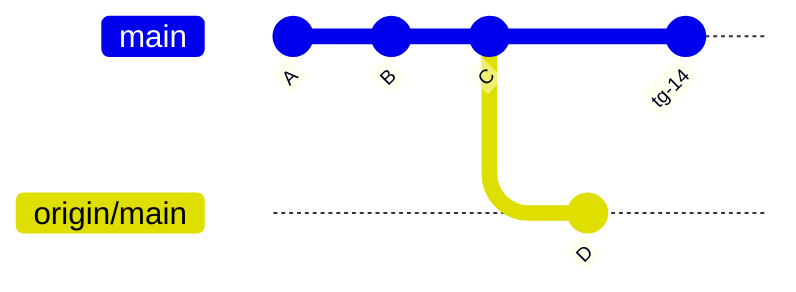
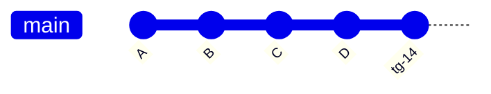
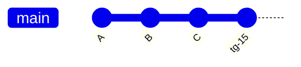
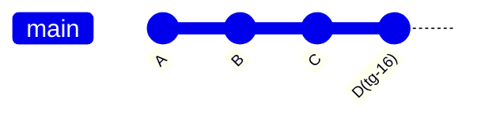
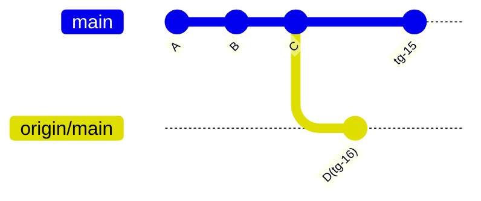
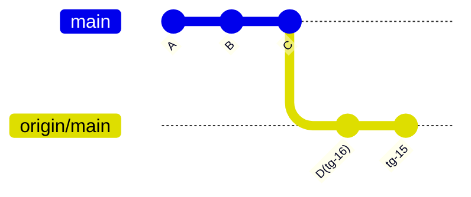
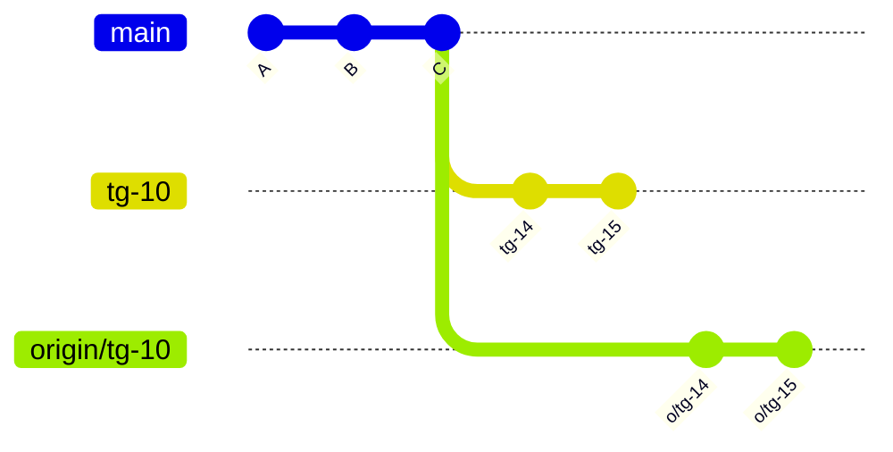
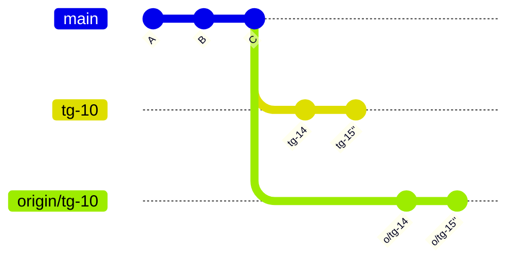

# gitlab-flow-explanation

tenemos



```
git push -u origin tg-14
```
crear un merge request (MR)
si se aprueba y se integra a main
y se borra `tg-14` remoto en origin.

## 1. caso feliz

si no hay conflicto
(rebase)


## 2. caso no feliz

Pero si alguien agregó cambios (commit D)



### 2.1 caso sin conflictos

no se puede hacer fast forward del merge request
con lo cual nos debemos traer esos cambios `origin/main` (branch local sincronizado con el remoto origin main):

`git fetch`

con lo cual queda en origin/main


y al hacer `git rebase origin/main` con lo cual queda:

puede ir todo bien... o pueden haber conflictos.
            
### 2.2 caso con conflictos

Supongamos que venimos de

y a partir de aquí alguien hace `tg-16` y
yo desde el mismo punto trabajo en `tg-15`

si ambos hacemos Merge Request y se aprueba antes el de `tg-16` sucede otra vez que no puedo hacer el `merge fast forward` con el Merge Request de `tg-15`

queremos hacer

pero ya existe en el remoto


con lo cual otra vez hacemos `git fetch`
mi origin/main local queda

cuando queramos hacer
el rebase pueden suceder conflictos

`git rebase origin/main`
```
error: could not apply ...
Resolve all conflicts
...
CONFLICT (Content): ... distancias.txt
```
se debe solucionar los conflictos en distancias.txt y agregar al `stage`

1. `git status`
2. `git add distancias.txt`
3. `git rebase --continue`

####
##### 2.2.1 éxito `git rebase --continue`

si todo fue bien

( origin main local )


(mi branch local)

pero ( origin tg-15 remoto)


es diferente debo forzar el push:

`git push --force-with-lease origin tg-15`


>[duda no sería origin tg-16 remoto?] {

>es diferente debo forzar el push:

>`git push --force-with-lease origin tg-16`

>}

force with lease (forzado pero no tan forzado)

##### 2.2.2 problemas `git rebase --continue`

si hay problemas puedo volver para atrás las cosas con `git rebase --abort` y hablar con alguien para ver como resolver.


## Escenario conflictivo `fixup o undo last commit` (porque se lo busca uno mismo) 


`git push --force-with-lease origin tg-10`



otro tendrá que hacer un `git reset --hard origin/tg-10`
